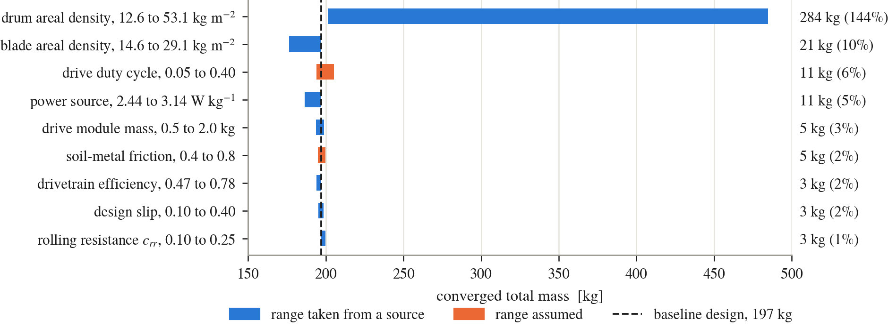

# Titan-mobility-system

**Preliminary sizing of a screw-propelled planetary rover, with Titan as the reference case.**

[](https://github.com/JasmineRimani/Titan-mobility-system/actions/workflows/tests.yml)
[](LICENSE)
[](LICENSE-DATA.md)
[](#how-to-cite)

This repository is the companion code and database of

> **A. Lukianov and J. Rimani**, "Preliminary Design and Performance
> Assessment of Screw-propelled Vehicle", *77th International Astronautical
> Congress (IAC)*, Antalya, Türkiye, 5-9 October 2026,
> IAC-26,A3,IP,204,x115954.

It is a small, readable Phase 0/A sizing method for screw-propelled rovers.
A subsystem mass and power budget is coupled with a reduced-order
screw-terrain model inside an iterative mass-closure loop. A vehicle
database, in which every value carries its definition, evidence level and
source, supplies the priors and the validation cases. The screw-terrain block
and the loop are checked against the full-scale trafficability tests of the
Marsh Screw Amphibian, and every table and figure of the paper is regenerated
from this code.

Pure Python, standard library only; matplotlib is needed only for the
figures. Every number in the package is either traced to a source in
`sources.yaml` or labelled `PLACEHOLDER`, `ASSUMED` or `CHOICE`. Nothing sits
in between.



*Paper Fig. 1. Which uncertain input moves the converged mass of the baseline
design, and by how much. Blue ranges are taken from a source, orange ranges
are assumed.*

---

## Quick start

```bash
git clone https://github.com/JasmineRimani/Titan-mobility-system.git
cd Titan-mobility-system

python run_example.py          # baseline Titan design, cross-checks, gravity study, sensitivity
python validate.py             # database priors and the Marsh Screw Amphibian validation
python make_paper_tables.py    # database tables of the paper, LaTeX in outputs/

pip install -r requirements.txt
python make_figures.py         # the five paper figures, PDF and PNG in figures/

python -m unittest discover -s tests -v   # checks that the code still reproduces the paper
```

Each script runs in a few seconds and writes only to `outputs/` and
`figures/`. Tested with Python 3.10 and 3.12.

To size a case of your own, change the inputs and call the loop directly:

```python
from sizing.mers import MassModel
from sizing.screw import ScrewGeometry
from sizing.sizing_loop import Mission, size
from sizing.terrain import TITAN_LUNAR_PROXY

res = size(Mission(payload_mass=20.0),
           ScrewGeometry(drum_diameter=0.60),
           TITAN_LUNAR_PROXY,
           mm=MassModel(drum_areal_density=18.0))
print(res.converged, round(res.total_mass, 1), res.feasible)
print(res.performance["drawbar_margin"])
print(res.checks)   # the screens of Table 6; this case fails the 213 kg mass screen
```

---

## What the paper finds

For a Titan reference mission (12 kg science payload, 0.028 m/s, 20 degree
slope, 0.10 m obstacle) on a lunar-analogue soil:

- The loop converges on a **two-screw vehicle of 197 kg** with 45 W of
  electrical drive power, inside the 213 kg lander-only benchmark of the
  TANDEM study. Drum 0.55 m, blade height 0.08 m, screw length 1.10 m, lead
  0.45 m.
- **The running gear carries the mass.** The drum shell areal density moves
  the converged mass by 144 percent across its evidence range; no other
  input moves it by more than about 10 percent. Closure inside the benchmark
  needs a drum shell below 14.3 kg/m2, a value only just met by the single
  measured screw module (ARCSnake, 12.7 kg/m2).
- **Flotation is not a limiting factor on Titan.** Static sinkage is 1.9 mm
  and contact pressure 1.6 kPa, and the drums alone displace 1.12 times the
  volume needed to float the vehicle in liquid methane.
- **Traction on the design slope governs.** Against the Marsh Screw
  Amphibian tests the contact model reproduces the ground pressure within
  16 percent, while the Mohr-Coulomb limit overestimates the measured
  drawbar pull by a factor of 1.5 to 3. Expressed as a screw traction
  efficiency of 0.35 to 0.65 and carried to Titan, the thrust margin on the
  20 degree slope drops from 2.45 to between 0.86 and 1.59.
- The mobility mass fractions in the database overlap (screw 0.16 to 0.49,
  wheeled 0.15 to 0.47), so the data alone do not show that screw mobility
  costs more mass than wheels.

The method does not demonstrate that screw propulsion is preferable to
wheeled or tracked mobility on Titan. It quantifies the cost of a
screw-propelled option and identifies its most sensitive inputs, which is
what a Phase 0 trade-off needs.

---

## Reproducing the paper

| Paper | Produced by |
|---|---|
| Tables 1, 2, 5, 6 and 7, the inputs | defaults in `sizing/environment.py`, `sizing/terrain.py`, `sizing/mers.py`, `sizing/screw.py` and `sizing/sizing_loop.py` |
| Tables 3 and 4, the database | `make_paper_tables.py` |
| Tables 8 and 9, the baseline design | `run_example.py` |
| Tables 10 and 11, the Marsh Screw Amphibian validation | `validate.py`, Levels A and C |
| Figs. 1 to 5 | `make_figures.py`, written to `figures/fig1_sensitivity` to `figures/fig5_feasibility_box` |

[`docs/PAPER_MAP.md`](docs/PAPER_MAP.md) maps every table, figure, equation
and reference of the paper to the script, function or `source_id` behind
it. The docstrings in `sizing/` give the paper equation each function
implements, and `tests/test_paper_numbers.py` checks the headline numbers of
the paper on every push.

---

## The method in one page

A screw-propelled rover cannot be sized by scaling a terrestrial vehicle,
because the vehicles that exist were built for a different gravity, a
different mission and a different mass definition. It also cannot be sized by
terramechanics alone, because pressure-sinkage and shear models tell you what
a vehicle of a given mass does on a given soil, but they do not tell you what
the motor weighs.

So the method is a loop:

```
guess total mass
  -> allocate subsystem masses, power and volume
  -> set screw geometry (N, D_drum, BH, L, p, lead angle, starts)
  -> screw-terrain block: sinkage, thrust, torque, mobility power
  -> size actuators from torque, size the power system from the duty cycle
  -> recompute total mass
  -> repeat to convergence
```

and a rule that protects it:

> **The database gives priors and validation cases. Physics closes the design.**

An Earth-derived mobility mass fraction may seed the loop. It may not survive
into the answer. By convergence, mobility mass is the sum of drums, helices,
motors, gearboxes, bearings, mounts and drive electronics. Comparing the
converged fraction back against the database range is then a sanity check,
not an assumption. `validate.py` prints both.

The screw-terrain block is a Bekker pressure-sinkage model on an
equivalent-cylinder contact patch, a Mohr-Coulomb traction limit with
Janosi-Hanamoto slip mobilisation scaled by a screw traction efficiency, and
a power-screw relation for torque. After convergence each candidate design
is screened for mass, relative sinkage, traction on the design slope, wind
overturning, mobility mass fraction, obstacle height and static flotation in
liquid methane (Table 6 of the paper).

The models, their sources, what is still a placeholder and why, and the
record of how the method changed on the way to the paper are in
[`docs/MODEL_NOTES.md`](docs/MODEL_NOTES.md).

---

## Repository layout

```
sizing/                 the model
  environment.py        Earth, Moon and Titan, each value with its source
  terrain.py            terrain cases as parameter sets, with evidence flags
  screw.py              reduced-order screw-terrain model and validity guards
  mers.py               mass relations and subsystem fractions
  sizing_loop.py        the fixed-point loop and the feasibility screens
run_example.py          baseline, cross-checks, gravity study, sensitivity, trade space
validate.py             database priors and validation Levels 0, A, B and C
make_paper_tables.py    database tables of the paper
make_figures.py         the five paper figures
fit_mers.py             actuator mass relations, for when catalogue data exist
data/
  vehicles.csv          24 vehicles and concepts, plus one labelled synthetic row
  benchmarks.csv        scalar results from the literature to check a design against
  running_gear.csv      the areal-density evidence behind the dominant coefficient
  actuators.csv         actuator rows with a documented mass
sources.yaml            every source behind every number, by source_id
figures/                the paper figures, PDF and PNG
tests/                  regression test against the numbers of the paper
docs/MODEL_NOTES.md     the detailed notes: models, sources, placeholders, validation
docs/PAPER_MAP.md       paper tables, figures, equations and references against the code
REFERENCES.md           reading list, grouped by which block of the method it supports
```

---

## The database

`data/vehicles.csv` holds terrestrial screw-propelled vehicles, laboratory
and planetary analogue systems, and comparison concepts based on wheels,
tracks and tensegrity locomotion. Four columns do most of the work:

- **mass_definition**: `m_dry`, `m_wet`, `m_operational`, `m_cbe`, `m_gross`.
- **power_type**: `P_peak`, `P_continuous`, `P_average`, `P_installed`,
  `P_measured`, `P_bol`. Battery energy divided by endurance is an average
  draw, not a motor rating.
- **evidence**: what kind of number each value is, per row, in words.
- **role_in_methodology**: what the row is allowed to be used for, from
  mobility mass benchmark and screw traction validation to qualitative
  architecture reference.

Plus **source_id**, which resolves in `sources.yaml`. A missing value is left
blank, never filled with a guess. Rows whose `source_id` starts with
`user_db_` were transcribed from the authors' working spreadsheet and have
not yet been resolved to a primary reference; none of them is used as a
validation case.

---

## Limitations

These are stated in the paper and repeated here so that nobody quotes the
numbers without them.

- The Titan soil is a lunar proxy, adopted after Genta and Genta (2011). It
  is the largest single source of uncertainty, and the terrain inputs are
  not measured Titan parameters.
- The Bekker parameters of the Marsh Screw Amphibian terrain cases are
  assumed or borrowed from other soils, because the test report gives cone
  index values only.
- Not modelled: lateral drift and sideslip, the switch to wheel-like rolling
  on hard ground, dynamic and slip-induced sinkage, bulldozing, multi-pass
  effects, interaction between screws, hydrodynamic drag and thrust in
  liquid, and the two failure modes observed on Earth, immobilisation by
  adhesive mud on ground firm enough to carry the vehicle and stall in
  saturated sand.
- The flotation screen is static and counts only the drum cylinders. It is
  not a claim of amphibious capability.
- The drive is sized with a fixed module mass and a 938:1 reduction from a
  5000 rpm motor. Direct drive at the screw speed is a valid alternative
  that the model does not size.
- The 213 kg benchmark is inherited from a comparator study, not derived
  from an entry, descent and landing analysis of a screw rover.
- The Marsh Screw Amphibian data were extracted from the digitised WES
  report and should be checked against the scanned pages before further
  use.

---

## Contributing data

Every data point found while coding or reading goes into the CSV, with its
`source_id` and page, not only into a report or a code comment. New rows need
`mass_definition`, `power_type`, `evidence`, `role_in_methodology` and
`source_id`; new sources go into `sources.yaml` with what they supply.

The additions that would reduce the uncertainty most, in the order given in
the paper:

1. the mass per unit area of a flight-representative screw drum and helix;
2. a screw-specific drawbar and torque test on a Titan-relevant granular
   simulant at low contact pressure;
3. terramechanical parameters of the surface of Titan;
4. any vehicle with both a documented mobility mass split and its screw
   geometry, which would make the Level B validation run on real data.

Issues and pull requests are welcome, in particular to resolve the
`user_db_` rows to primary references.

---

## How to cite

If you use the code or the database, please cite the paper:

```bibtex
@inproceedings{lukianov2026screw,
  author    = {Lukianov, Artur and Rimani, Jasmine},
  title     = {Preliminary Design and Performance Assessment of
               Screw-propelled Vehicle},
  booktitle = {Proceedings of the 77th International Astronautical
               Congress (IAC)},
  address   = {Antalya, T{\"u}rkiye},
  publisher = {International Astronautical Federation},
  month     = oct,
  year      = {2026},
  note      = {IAC-26,A3,IP,204,x115954}
}
```

`CITATION.cff` carries the same information, so GitHub shows a "Cite this
repository" button on the repository page.

---

## License

- Code (`*.py`): MIT, see [`LICENSE`](LICENSE).
- Database (`data/`, `sources.yaml`), figures and documentation: CC BY 4.0,
  see [`LICENSE-DATA.md`](LICENSE-DATA.md).

The publications indexed in `sources.yaml` are not redistributed here. Each
value in the database points to its source so that it can be checked there.

---

## Authors

Artur Lukianov and Jasmine Rimani, Politecnico di Torino, Turin, Italy.
Questions, corrections and new data points: please open an issue.
